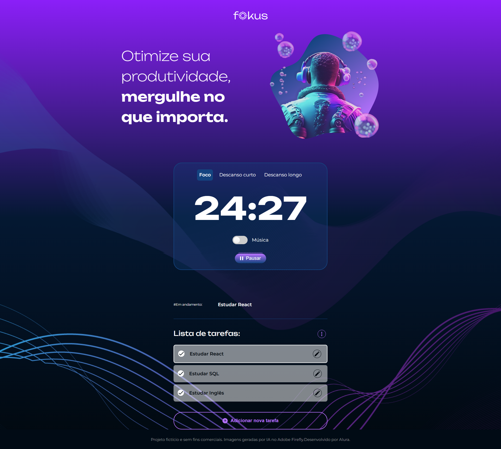

<h1>Code Connect</h1>

<h3> Site de produtividade para estudar com técnica de Pomodoro. </h3>



<h2>Funcionalidades</h2>

- Adicionar tarefas
- Selecionar, concluir, editar e remover tarefas
- Musica para focar
- Timer Pomodoro de 25 minutos
- Pausas de 5 e 15 minutos
- Conteúdo é salvado pelo navegador

<h2>Como Acessar</h2>

A página pode ser acessada através deste [link](https://pomodoro-fokus-sigma.vercel.app/) 

ou realizando um clone deste repositório e acessando o index.html:
```
https://github.com/DFedizko/pomodoro-fokus.git
```

<h3>Tecnologias Utilizadas</h3>
<div>
  
  
  
</div>

<h2>Sobre</h2>

O projeto Fokus é uma página que contém um ToDo List para estudar com a técnica Pomodoro, ela foi criada em HTML, CSS e JavaScript.

O localStorage do navegador foi utilizado para salvar as tarefas adicionadas pelo usuário, isso significa que mesmo se o usuário recarregar a página as tarefas continuarão lá, sem precisar de um banco de dados.

<h2>Desenvolvedor</h2>


| [<br><sub>Pedro Fedizko de Castro</sub>](https://github.com/DFedizko) |
| :---: |
